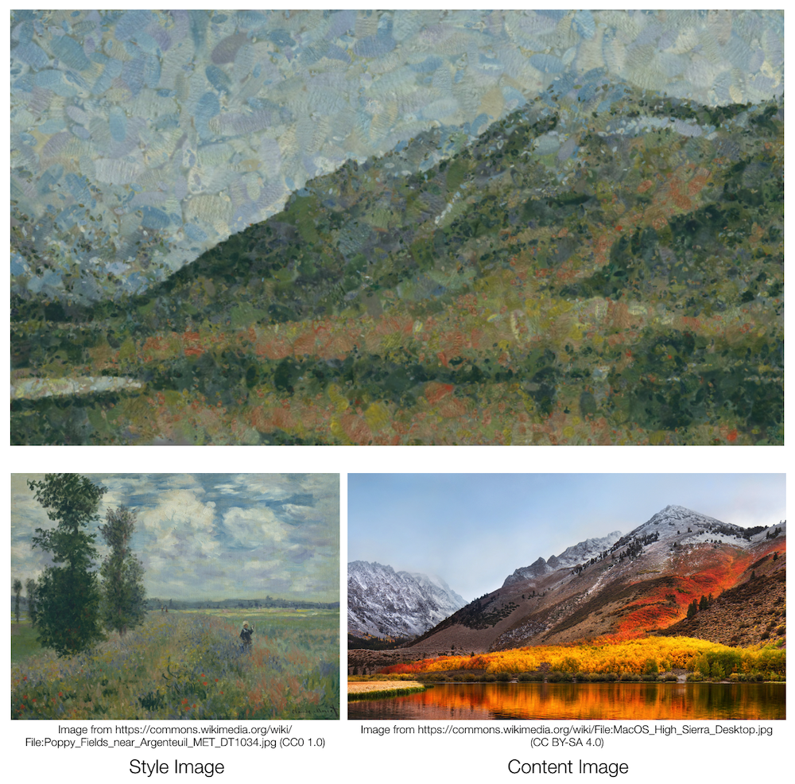
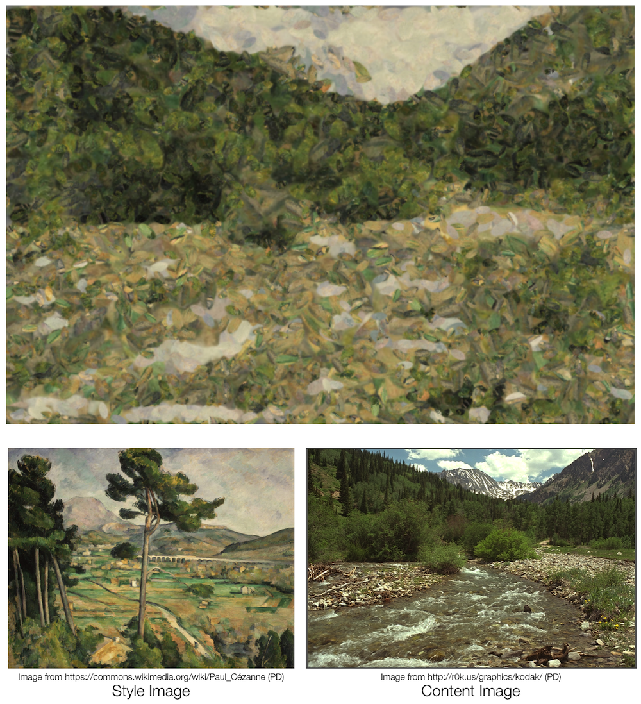
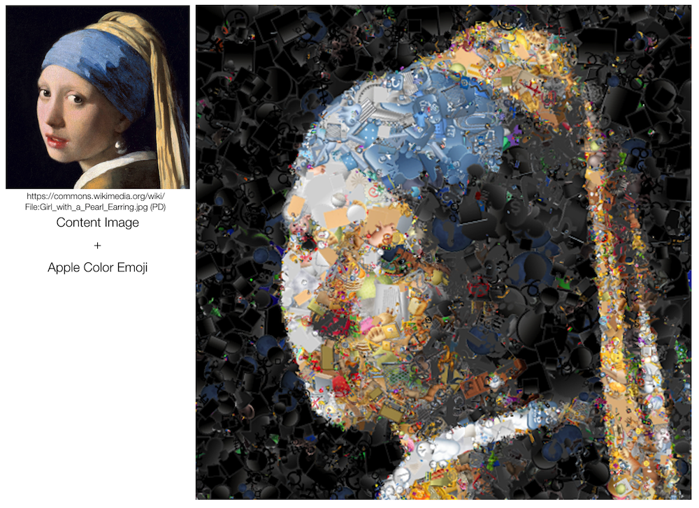
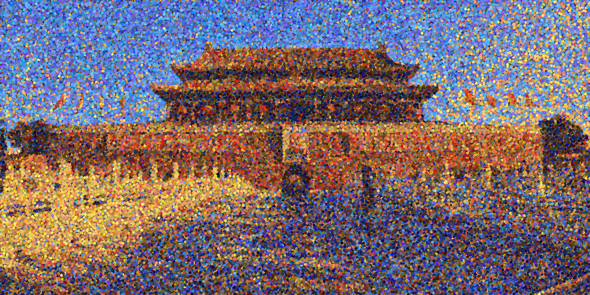
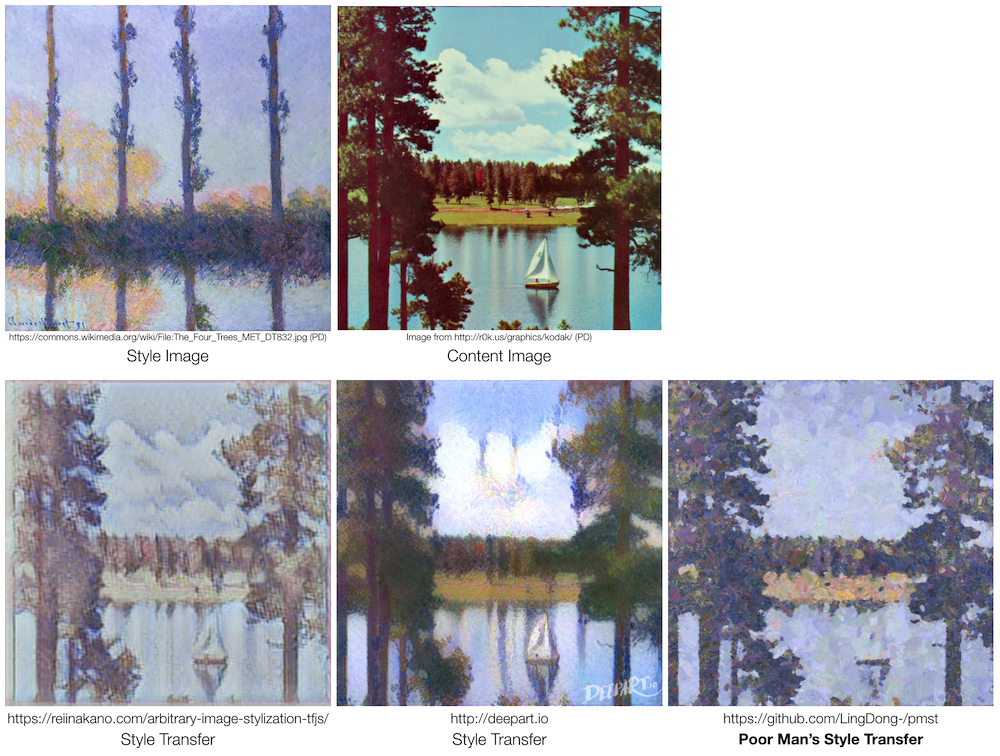

# pmst
Poor Man's Style Transfer - Painting an image with the style of another, without the machine learning.

The algorithm:

```
Repeat until happy:
	Propose K marks, each with randomized position, scale, and optionally rotation
	Select the mark that minimize Euclidean distance between canvas and reference image
	Apply that mark
```
### Impressionism ✔︎




### Emoji Paintings ✔︎



[Marriage at Cana](https://en.wikipedia.org/wiki/Marriage_at_Cana), from 10,000 emojis.

[The School of Athens](https://en.wikipedia.org/wiki/The_School_of_Athens), from 10,000 emojis.

### Pointillism ✔︎

[Photograph of the Gate of Heavenly Peace](https://commons.wikimedia.org/wiki/File:Tiananmen_beijing_Panorama.jpg), from 20,000 dots.

### Other -isms? Doesn't quite work ✘

Not yet!

### Compare with the Real Style Transfer


## Basic algorithm

The input to the program are two images, the first is the "reference image", it contains the content/subject we want to see in the result; The second is the "spritesheet", we want our result to be stylistically/locally similar to this image.

The algorithm is an iterative process, where we continuously modify a canvas by pasting "sprites" from the spritesheet so that the canvas looks more and more similar to the reference image.

To describe this process more rigorously, we first define the following:

- Define the distance between the canvas and the reference image to be the sum of the Euclidean distance between individual pixels

- Define an mark to be the pasting of a sprite (small subsection of spritesheet) onto a certain location on canvas

Thus we can describe (a simplified version of) the algorithm with the following pseudocode:

```
Repeat n times:
	Propose K marks, each with randomized position, scale, and optionally rotation
	Select the mark that minimize distance between canvas and reference image
	Apply that mark
```

For more details on the algorithm and more sophisticated features, see **Additional techniques** section.

## Compile & run

### Dependency

The only dependency is [OpenCV](https://opencv.org) (C++). Version 4.x is recommended (Tested on 3.4 and 4.1). if you're on a mac, `brew install opencv`, otherwise, try [this](https://www.google.com/search?q=how+to+install+opencv).

### Compile source code

After OpenCV is installed, use this one-liner to compile the program:

```bash
c++ main.cpp -lopencv_highgui -lopencv_imgproc -lopencv_core -lopencv_imgcodecs -I/usr/local/include/opencv4 -std=c++11
```

If you're using a OpenCV version 3 or below or installed OpenCV at an otherwise different location, you might need to change the include path.

If compilation was successful, you'll have an executable called `a.out` in the same directory.

### Prepare test images

Before you run the program, you might want to download some sample images to test on. You can find some on your own, or run my script that downloads a bunch for you, like so:

```bash
sh tools/download_test_images.sh
```

Now you have to pick two images, one for the reference image (content) and one for the spritesheet (style). 

For the spritesheet to be interpreted by the program at a desirable scale, you need to resize/crop it so that its width and height are `n * u` by `m * u`, with `u` being the width of a single sprite. In other words, you'll have a sheet of `m*n` sprites each of the size `u`x`u`. If you downloaded the monet picture with my script, try resizing it to `3200x2400` pixels (`u=100`).

For generating the emoji paintings, you'll need an emoji spritesheet instead. This can be done by opening `tools/emoji-spritesheet.html` in your favorite browser, waiting a second for the loading, and right-click-downloading the image.

For generating pointillist paintings, you'll need a spritesheet of colored dots instead. This can be done by running `tools/pointillism-spritesheet.py`. You'll need to install python and opencv-python, but the script is really quite simple and can probably be reproduced with the imaging language/tool of your choice.

### Running the program

The program reads all its arguments from a single XML file. The XML file defines input images, parameters, etc. You can find some presets in the `presets/` folder. We'll explain the advanced parameters in **Parameters** section, for now just to test things out open one of the `presets/preset_*.xml` in your favorite editor and:

- Change `<ref_path>` to path to your reference image
- Change `<sheet_path>` to path to your spritesheet
- Change `<sprite_w>` to the width of each sprite (`u`). For the emoji spritesheet, this would be `128`.
- Change `<sprite_n>` to the total number of sprites in your spritesheet (`(width/u)*(height/u)`, or for the emoji spritesheet, `1564`)

Finally! run the program by typing in the terminal:

```
./a.out path/to/my_parameters.xml
```

A window will pop up, and you can watch your image as it is being painted. ✌️


## Parameters

To create your own `parameters.xml`, first duplicate one of the presets in `presets/` folder. (If you start from scratch, you risk breaking something since OpenCV only reads a subset of the XML specification). Then change some of the parameters explained below:

- `<ref_path>` path to reference image
- `<sheet_path>` path to spritesheet image
- `<marks_path>` path to a save (or load) the "marks" file, in which all the operation applied will be listed in xml format, so later you can "reanimate" the painting process, or perhaps re-paint at a larger scale after you generated data on a smaller image. This file will be updated periodically while the program is running.
- `<render_path>` path where the final rendered image will be saved. This file will be updated periodically while the program is running.
- `<sprite_w>` the width of each sprite
- `<sprite_n>` total number of sprites in spritesheet
- `<action>` either `0` or `1`. `0` will be running the normal program on the input images. `1` will be the "re-paint" mode, where it loads the XML at `<marks_path>` (see above) and re-render according to the operations listed there.
- `<max_iter>` total number of iterations (not counting the underpainting phase, see below), probably in the thousands
- `<var_iter>` number of iterations where the size of the marks varies. In the beginning bigger marks are used and the size gradually decreases, until after `<var_iter>` iterations it stops at a constant size (except for slight random variations from `<mark_w_var>`). See **Additional techniques > Adaptive K and mark size** section for details.
- `<max_k>` maximum `K` (number of marks to select from at each iteration). Larger this number, more accurately the painting resembles the reference image (and longer it takes to finish). See **Additional techniques > Adaptive K and mark size** section for details.
- `<underpaint_iter>` number of underpainting iterations (not included by `<max_iter>`). During each underpainting iteration, a random mark is slapped onto the canvas at a random location in an attempt to fill the canvas, forming an underpainting layer. See **Additional techniques > Underpainting** section for details.
- `<mark_w_min>` minimum width of the marks. See `<var_iter>`.
- `<mark_w_max>` maximum width of the marks. See `<var_iter>`.
- `<mark_w_var>` random variation in the width of the marks. See `<var_iter>`.
- `<repaint_scale>` if `<action>` is `1`, this sets the scale of the re-rendering. If it's `1`, you get the same image as before. Set it to `2` or more to get a nice big rendering. See `<action>`.
- `<display_wip>` whether or not to display "work in progress". If `0`, the GUI will be off and the program might run slightly faster. If `1`, you can watch the image as it's being painted.
- `<adaptive_k>` either `0` or `1`. Whether or not to use an adaptive `K`, i.e. increase the number of marks to choose from over time, so that later iterations are more carefully considered. See **Additional techniques > Adaptive K and mark size**
- `<rotate_marks>` either `0` or `1`. Whether or not the marks are randomly rotated. Usually you want that on to achieve a more organic/painterly look, but certain spritesheets might contain imageries whose inherent orientations are important.
- `<gauss_kern>` either `0` or `1` or `2`. A "vignette" like alpha mask (a.k.a. gaussian kernel) can be applied to each sprite in the spritesheet to make it look more like a "brushstroke". `0` is no such mask, `1` is a round mask, and `2` is an elliptical mask. For crisp images like the emoji spritesheet, this should be `0`. For the painterly images, `2`(or sometimes `1`) provides better results. This is of course just a conveniency feature with not many options to choose from, so if you have a specific idea about the shape of your brushstrokes, you should edit it into the spritesheet using external software. 
- `<remap_color>`. `0` or `1`. Whether or not to bias the tone of the reference image, so that it looks more similar to that of the spritesheet. See **Additional techniques > Color remapping**.

Lots of options!

## Additional techniques

While the main algorithm can be covered by the pseudocode in the section **Basic algorithms**, more sophisticated techniques used by the software are summarized below:

### Color remapping

The color tone of the reference image is sometimes quite different from the spritesheet. If we're a given a green apple, we cannot paint it with red paint only. Therefore, the idea is to bias the tone of the reference image so that it more or less matches that of the spritesheet, so we can optimally utilize the colors we have. This is achieved by calculating the mean and standard deviation, and offsetting/scaling all pixels by the difference.

### Underpainting

Say we started with a white canvas. The reference image might have a region that is white. Then, that region of the canvas will never be painted on by the algorithm because it is considered already perfectly optimal, resulting in an (ugly) hole in our final result. The same is true for canvases initialized with any color.

One way is to define a chroma key, a "special color" that is infinitely dissimilar to any other color. In this software however, the idea of "underpainting" is borrowed from the fine art of painting. Before we start the main iteration, we fill the entire canvas with random pieces from the spritesheet. (Painters tend to use a monotone brownish or bluish color, for our algorithm this choice doesn't seem to matter that much.)


### Adaptive K and mark size

During the main iteration when we slap random pieces from the spritesheet onto the canvas, we might want to vary the scale of these marks. Again the idea is borrowed from paining: early on, we have big bold brushstrokes to establish the forms, while near the end, we use small brushstrokes to give fine details and touches.

Similarly, we also want to gradually increase K, the number of marks to choose from at each iteration. Early on, we don't need to be too careful, while at later stages, we want to be perfect.

### Saliency based probability distribution

I think one of the most important reasons I can immediately tell between a real painting and a "painting" filter applied to some photo, is that the latter does not respect human perception of saliency. A filter would give attention and detail to random unimportant objects in the background exactly like it does to the main subject. The painter in comparison often gives different treatment to objects of different importance (though the degree varies from artist to artist).

Our algorithm suffers from the same problem if we choose the location of edits in each iteration uniform-randomly. But in fact, it's even worse: it will tend to paint more on unimportant flat areas because it would be the "safest". If it instead tries to paint the more intricate areas and "mess up", it will be penalized by our loss metric. Thus we end up with a canvas where some monotone background gets many layers of edits, and the areas we actually care about end up in a nondescript, unfinished-looking state.

The solution I implemented is to pre-calculate a probability distribution for the reference image, giving the "interesting" areas higher probabilities to be selected for edits during the iteration. I used image gradients (Sobel filter + Gaussian blur) as a simple criteria for "interestingness", though perhaps face/human/object detector or [a saliency neural net](https://github.com/imatge-upc/salgan) can be used (But then the current name of the project will be a misnomer as these involves machine learning).
